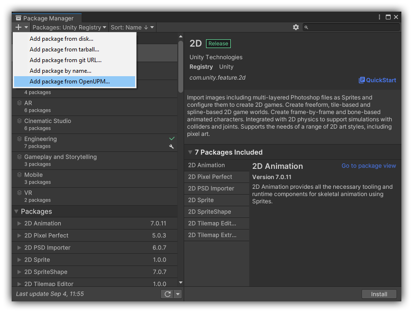
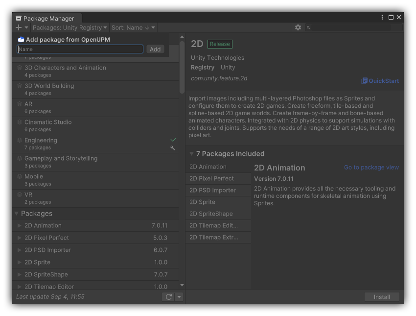

# UPM OpenUPM Extension
[](https://github.com/nmacadam/com.nmacadam.upm-openupm-extension/releases)
[](https://openupm.com/packages/com.nmacadam.upm-openupm-extension/)
[](https://github.com/semantic-release/semantic-release)
[](/LICENSE)

This package adds a custom dropdown menu item to the Package Manager window for installing OpenUPM packages.




Use the package name as you would for the `openupm add` CLI command, including any versioning.

## 🪛 Installation
Install [OpenUPM CLI](https://openupm.com/docs/getting-started.html) if you have not already, it's required for the package to work.

<details>
  <summary>Install with <a href="https://openupm.com/packages/com.nmacadam.notate/">OpenUPM</a> via CLI or scoped registry (recommended)</summary>

  <br />

&emsp;✨ *To add a package via [openupm-cli](https://github.com/openupm/openupm-cli), run the following command:*

&emsp;`openupm install com.nmacadam.upm-openupm-extension`

  <br />

&emsp;🗃️ *To add a package via scoped registry:*

- Open `Edit/Project Settings/Package Manager`
- Add a new Scoped Registry:
  ```
  Name: OpenUPM
  URL:  https://package.openupm.com/
  Scope(s): com.nmacadam
  ```
- Open `Window/Package Manager`
- Click <kbd>+</kbd>
- <kbd>Add from Git URL</kbd>
- `com.nmacadam.upm-openupm-extension` <kbd>Add</kbd>

</details>
<details>
  <summary>Install with Git URL</summary>

  <br />

- Open `Window/Package Manager`
- Click <kbd>+</kbd>
- <kbd>Add from Git URL</kbd>
- `https://github.com/nmacadam/com.nmacadam.upm-openupm-extension.git` <kbd>Add</kbd>

&emsp;Note that you won't be able to receive updates through Package Manager this way, you'll have to update manually.

</details>
<details>
  <summary>Install manually</summary>

  <br />

- Download the [upm](https://github.com/nmacadam/Notate/tree/upm) branch of this repository as a .zip file and extract it
- Open `Window/Package Manager`
- Click <kbd>+</kbd>
- <kbd>Add package from disk</kbd>
- Select `package.json` in the extracted folder

&emsp;Note that you won't be able to receive updates through Package Manager this way, you'll have to update manually.

</details>